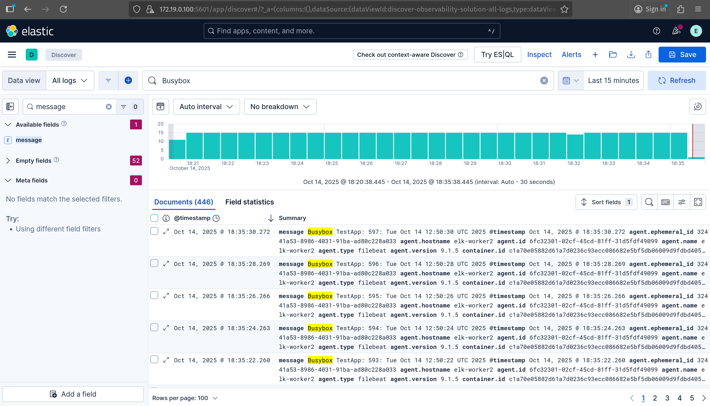
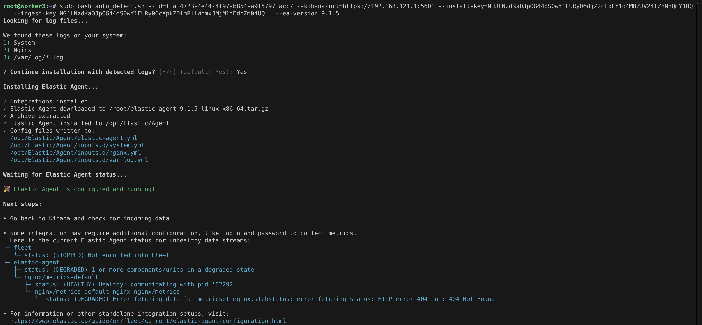
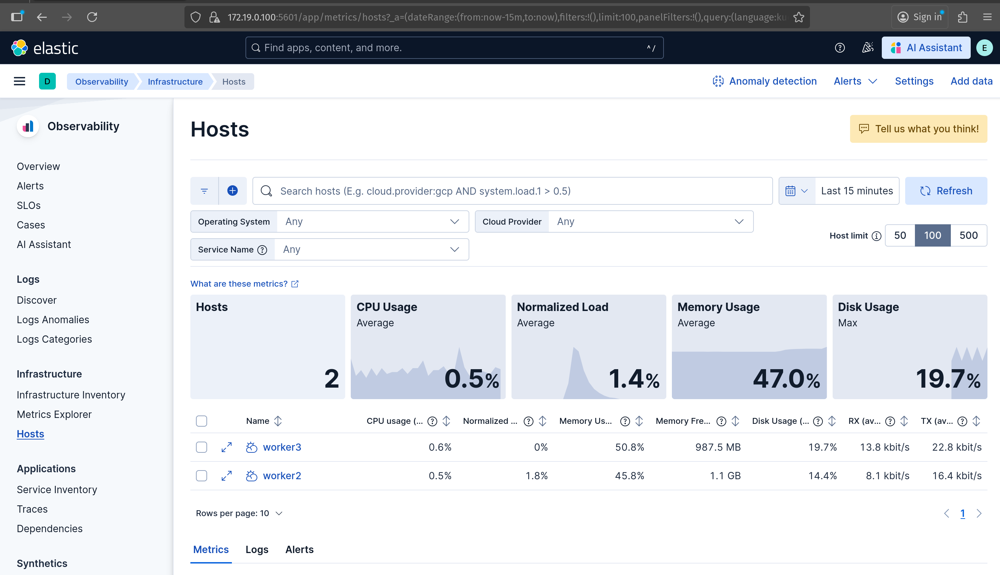

# Week 7
- We explored ELK Stack in this week.

# Elasticsearch (ECK) Operator
- Here, we are deploying ELK Stack using ECK Operator on Kubernetes.

## Provision VM
- I am using [Vagrantfile](./Vagrantfile) to provision VM for me in local infrastructure.
- For me, IP of each nodes:
    - Host: `192.168.121.1`
    - ELK: `192.168.121.2`
    - Worker1: `192.168.121.101`
    - Worker2: `192.168.121.166`
    - Worker3: `192.168.121.59`

## ELK Deployment Options
- There are two ways to deploy ELK Stack:
    - Docker
    - Kubernetes

> [!NOTE]: We will be following Kubernetes so you can simply ignore Deployment using Docker if you want.

# Docker
- Install Docker inside VM using below script:
    ```sh
    #!/bin/bash

    # Add Docker's official GPG key:
    sudo apt-get update
    sudo apt-get install ca-certificates curl gnupg -y
    sudo install -m 0755 -d /etc/apt/keyrings
    curl -fsSL https://download.docker.com/linux/ubuntu/gpg | sudo gpg --dearmor -o /etc/apt/keyrings/docker.gpg
    sudo chmod a+r /etc/apt/keyrings/docker.gpg

    # Add the repository to Apt sources:
    echo \
    "deb [arch="$(dpkg --print-architecture)" signed-by=/etc/apt/keyrings/docker.gpg] https://download.docker.com/linux/ubuntu \
    "$(. /etc/os-release && echo "$VERSION_CODENAME")" stable" | \
    sudo tee /etc/apt/sources.list.d/docker.list > /dev/null
    sudo apt-get update
    sudo apt-get install docker-ce docker-ce-cli containerd.io docker-buildx-plugin docker-compose-plugin -y

    sudo usermod -aG docker $USER
    newgrp docker
    ```
## ELK Stack in Docker
- Deploy local Development for ELK stack. For More Visit [here](https://www.elastic.co/docs/deploy-manage/deploy/self-managed/local-development-installation-quickstart).
    ```sh
    curl -fsSL https://elastic.co/start-local | sh
    ```

- Once everything is ready, we will get output like below:
    ```sh
    🎉 Congrats, Elasticsearch and Kibana are installed and running in Docker!

    🌐 Open your browser at http://localhost:5601

    Username: elastic
    Password: pk8jdTIQ

    🔌 Elasticsearch API endpoint: http://localhost:9200
    🔑 API key: bUNNRTRaa0JLM1o0TWtYOFJoZ1M6WV9qVUJMWEdMNXJfRTUzQTJ1MmwwZw==


    Learn more at https://github.com/elastic/start-local
    ```

- By default, these ports are only open in `127.0.0.1` interface. So modify docker-compose.yaml file by running below command.
    ```sh
    cd elastic-start-local
    sed -i 's/127\.0\.0\.1/0.0.0.0/g' docker-compose.yml
    ./stop.sh
    ./start.sh
    ```

- Container status:
    ```sh
    vagrant@ELK:~/elastic-start-local$ docker compose ps -a
    NAME                    IMAGE                                                 COMMAND                  SERVICE           CREATED          STATUS                        PORTS
    es-local-dev            docker.elastic.co/elasticsearch/elasticsearch:9.1.5   "/bin/tini -- /usr/l…"   elasticsearch     15 minutes ago   Up About a minute (healthy)   0.0.0.0:9200->9200/tcp, 9300/tcp
    kibana-local-dev        docker.elastic.co/kibana/kibana:9.1.5                 "/bin/tini -- /usr/l…"   kibana            15 minutes ago   Up 56 seconds (healthy)       0.0.0.0:5601->5601/tcp
    kibana-local-settings   docker.elastic.co/elasticsearch/elasticsearch:9.1.5   "/bin/tini -- /usr/l…"   kibana_settings   18 minutes ago   Exited (0) 56 seconds ago 
    ```

- In above output, we can see that ports are opened in all interface that is `0.0.0.0`.

## Access Kibana UI:
- Visit: http://192.168.121.2:5601
- Login with Creds:
    - Username: `elastic`
    - Password: `pk8jdTIQ`

#  K8s cluster
- I am using [Kind](https://kind.sigs.k8s.io/docs/user/quick-start/#creating-a-cluster) to create local K8s cluster.
- `Kind` was already installed in my Host Machine. So I have deployed Kind Cluster in my Host machine instead of any VMs.
- Command:
    ```sh
    kind create cluster --config cluster-config.yaml
    ```

- Output:
    ```
    Creating cluster "elk" ...
    ✓ Ensuring node image (kindest/node:v1.34.0) 🖼 
    ✓ Preparing nodes 📦 📦 📦  
    ✓ Writing configuration 📜 
    ✓ Starting control-plane 🕹 
    ✓ Installing CNI 🔌 
    ✓ Installing StorageClass 💾 
    ✓ Joining worker nodes 🚜 
    Set kubectl context to "kind-elk"
    You can now use your cluster with:

    kubectl cluster-info --context kind-elk

    Not sure what to do next? 😅  Check out https://kind.sigs.k8s.io/docs/user/quick-start/
    ```

- Test:
    ```sh
    k get no -o wide
    ```

- Output:
    ```sh
    NAME                STATUS   ROLES           AGE   VERSION   INTERNAL-IP   EXTERNAL-IP   OS-IMAGE                         KERNEL-VERSION             CONTAINER-RUNTIME
    elk-control-plane   Ready    control-plane   9h    v1.34.0   172.19.0.4    <none>        Debian GNU/Linux 12 (bookworm)   6.12.10-76061203-generic   containerd://2.1.3
    elk-worker          Ready    <none>          9h    v1.34.0   172.19.0.2    <none>        Debian GNU/Linux 12 (bookworm)   6.12.10-76061203-generic   containerd://2.1.3
    elk-worker2         Ready    <none>          9h    v1.34.0   172.19.0.3    <none>        Debian GNU/Linux 12 (bookworm)   6.12.10-76061203-generic   containerd://2.1.3
    ```

- Used alias:
    ```sh
    k=kubectl
    kaf='kubectl apply -f'
    kd='kubectl describe'
    kdf='kubectl delete -f'
    ```

## Deploy MetalLB for LoadBalancer
- Make sure `helm` is installed. If not follow below command:
    ```sh
    curl -fsSL -o get_helm.sh https://raw.githubusercontent.com/helm/helm/main/scripts/get-helm-3
    chmod 700 get_helm.sh
    ./get_helm.sh
    ```
- Install MetalLB using below command:
    ```sh
    helm repo add metallb https://metallb.github.io/metallb
    kubectl create ns metallb-system
    helm install metallb metallb/metallb -n metallb-system
    kubectl get all -n metallb-system
    ```
- Inspect Docker Network:
    ```sh
    docker network inspect kind | jq -r '.[0].IPAM.Config[] | select(.Subnet | test("^([0-9]{1,3}\\.){3}[0-9]{1,3}/")) | .Subnet'
    ```
- For me, output is `172.19.0.0/16`. So I have IP Pool for LoadBalancer: `172.19.0.100-172.19.0.200`

- Configure Metal LB IPAddressPool:
    ```sh
    kaf Manifests/MetalLB/metallb-ipPool.yaml
    ```

## Deploy ELK Operator in Kubernetes Cluster
- We can deploy ELK Operator in K8s cluster using two approach:
    - <b>K8s Manifest Files</b>
    - <b>Helm Charts</b>: For Helm Chart, Visit Here: https://www.elastic.co/docs/deploy-manage/deploy/cloud-on-k8s/install-using-helm-chart

### K8s Manifest Files
- Deploy ECK operator using K8s Manifest files.
- Install Elastic's CRD:
    ```sh
    kubectl create -f https://download.elastic.co/downloads/eck/3.1.0/crds.yaml
    ```

    <details>
    <summary>Detailed Output</summary>
    <blockquote>

    ~~~sh
    customresourcedefinition.apiextensions.k8s.io/agents.agent.k8s.elastic.co created
    customresourcedefinition.apiextensions.k8s.io/apmservers.apm.k8s.elastic.co created
    customresourcedefinition.apiextensions.k8s.io/beats.beat.k8s.elastic.co created
    customresourcedefinition.apiextensions.k8s.io/elasticmapsservers.maps.k8s.elastic.co created
    customresourcedefinition.apiextensions.k8s.io/elasticsearchautoscalers.autoscaling.k8s.elastic.co created
    customresourcedefinition.apiextensions.k8s.io/elasticsearches.elasticsearch.k8s.elastic.co created
    customresourcedefinition.apiextensions.k8s.io/enterprisesearches.enterprisesearch.k8s.elastic.co created
    customresourcedefinition.apiextensions.k8s.io/kibanas.kibana.k8s.elastic.co created
    customresourcedefinition.apiextensions.k8s.io/logstashes.logstash.k8s.elastic.co created
    customresourcedefinition.apiextensions.k8s.io/stackconfigpolicies.stackconfigpolicy.k8s.elastic.co created
    ~~~

    </blockquote>
    </details>

- Install the operator with its RBAC rules.
    ```sh
    kubectl apply -f https://download.elastic.co/downloads/eck/3.1.0/operator.yaml
    ```

    <details>
    <summary>Detailed Output</summary>
    <blockquote>

    ~~~sh
    namespace/elastic-system created
    serviceaccount/elastic-operator created
    secret/elastic-webhook-server-cert created
    configmap/elastic-operator created
    clusterrole.rbac.authorization.k8s.io/elastic-operator created
    clusterrole.rbac.authorization.k8s.io/elastic-operator-view created
    clusterrole.rbac.authorization.k8s.io/elastic-operator-edit created
    clusterrolebinding.rbac.authorization.k8s.io/elastic-operator created
    service/elastic-webhook-server created
    statefulset.apps/elastic-operator created
    validatingwebhookconfiguration.admissionregistration.k8s.io/elastic-webhook.k8s.elastic.co created
    ~~~

    </blockquote>
    </details>

## Deploy ELK Cluster
- We have [elk-manifest.yaml](./Manifests/ECK/elk-manifest.yaml) file which contains Elasticsearch and Kibana.
- If we look closely, it is using namespace `elk`.
- Deploy:
    ```sh
    k create ns elk
    kaf Manifests/ECK/elk-manifest.yaml
    ```

- After successful deployments:
    ```sh
    k get all,secrets -n elk 
    ```

    <details>
    <summary>Detailed Output</summary>
    <blockquote>

    ~~~sh
    NAME                                 READY   STATUS    RESTARTS   AGE
    pod/elk-cluster-es-default-0         1/1     Running   0          57s
    pod/elk-cluster-es-default-1         1/1     Running   0          57s
    pod/elk-cluster-es-default-2         1/1     Running   0          57s
    pod/elk-kibana-kb-7845cfb45c-nq85d   1/1     Running   0          57s

    NAME                                   TYPE           CLUSTER-IP      EXTERNAL-IP    PORT(S)          AGE
    service/elk-cluster-es-default         ClusterIP      None            <none>         9200/TCP         57s
    service/elk-cluster-es-http            ClusterIP      10.96.163.88    <none>         9200/TCP         58s
    service/elk-cluster-es-internal-http   ClusterIP      10.96.170.194   <none>         9200/TCP         58s
    service/elk-cluster-es-transport       ClusterIP      None            <none>         9300/TCP         58s
    service/elk-kibana-kb-http             LoadBalancer   10.96.90.105    172.19.0.100   5601:32069/TCP   57s

    NAME                            READY   UP-TO-DATE   AVAILABLE   AGE
    deployment.apps/elk-kibana-kb   1/1     1            1           57s

    NAME                                       DESIRED   CURRENT   READY   AGE
    replicaset.apps/elk-kibana-kb-7845cfb45c   1         1         1       57s

    NAME                                      READY   AGE
    statefulset.apps/elk-cluster-es-default   3/3     57s

    NAME                                               TYPE     DATA   AGE
    secret/elk-cluster-es-default-es-config            Opaque   1      57s
    secret/elk-cluster-es-default-es-transport-certs   Opaque   7      57s
    secret/elk-cluster-es-elastic-user                 Opaque   1      58s
    secret/elk-cluster-es-file-settings                Opaque   1      57s
    secret/elk-cluster-es-http-ca-internal             Opaque   2      57s
    secret/elk-cluster-es-http-certs-internal          Opaque   3      57s
    secret/elk-cluster-es-http-certs-public            Opaque   2      57s
    secret/elk-cluster-es-internal-users               Opaque   5      58s
    secret/elk-cluster-es-remote-ca                    Opaque   1      57s
    secret/elk-cluster-es-transport-ca-internal        Opaque   2      57s
    secret/elk-cluster-es-transport-certs-public       Opaque   1      57s
    secret/elk-cluster-es-xpack-file-realm             Opaque   4      58s
    secret/elk-elk-kibana-kibana-user                  Opaque   2      57s
    secret/elk-kibana-kb-config                        Opaque   1      57s
    secret/elk-kibana-kb-es-ca                         Opaque   2      57s
    secret/elk-kibana-kb-http-ca-internal              Opaque   2      57s
    secret/elk-kibana-kb-http-certs-internal           Opaque   3      57s
    secret/elk-kibana-kb-http-certs-public             Opaque   2      57s
    secret/elk-kibana-kibana-user                      Opaque   4      57s
    ~~~

    </blockquote>
    </details>

### Get Login Creds:
- Command. Below command with print password in plain text:
   ```sh
    k -n elk get secret elk-cluster-es-elastic-user -o json | jq -r .data.elastic | base64 -d ; echo
    ```
- Output will be similar like below:
    ```sh
    M7u3Y16wm9W06IoYw08n1qok
    ```

### Port Forward:
- List Services:
    ```sh
    k -n elk get svc
    ```

    <details>
    <summary>Detailed Output</summary>
    <blockquote>

    ~~~sh
    NAME                           TYPE           CLUSTER-IP      EXTERNAL-IP    PORT(S)          AGE
    elk-cluster-es-default         ClusterIP      None            <none>         9200/TCP         4m41s
    elk-cluster-es-http            ClusterIP      10.96.163.88    <none>         9200/TCP         4m42s
    elk-cluster-es-internal-http   ClusterIP      10.96.170.194   <none>         9200/TCP         4m42s
    elk-cluster-es-transport       ClusterIP      None            <none>         9300/TCP         4m42s
    elk-kibana-kb-http             LoadBalancer   10.96.90.105    172.19.0.100   5601:32069/TCP   4m41s
    ~~~

    </blockquote>
    </details>

- Visit: https://172.19.0.100:5601. Login using above creds: `elastic`:`M7u3Y16wm9W06IoYw08n1qok`.


### Deploy Logstash
- Command:
    ```sh
    kaf Manifests/ECK/logstash.yaml 
    ```

### Deploy Beat:
- HeartBeat:
    ```sh
    kaf Manifests/ECK/heartbeat.yaml 
    ```

### Deploy FileBeat:
- Before deploying filebeat manifest file, make a change to elastic password in your case.
- Deploy:
    ```sh
    kaf Manifests/ECK/filebeat.yaml
    ```

### Deploy Test App:
- Command:
    ```sh
    kaf Manifests/ECK/busybox-testapp.yaml 
    ```

## Kibana UI:
- Visit: https://172.19.0.100:5601. 
- Login using above creds: `elastic`:`M7u3Y16wm9W06IoYw08n1qok`.
- Then go to `Observability` -> `Logs`. We can see all logs.
- Now, type `message` in left search box and `Busybox` in right search box. We can see from our Busybox Testapp.
    

> [!NOTE]: `Busybox` is from logs file not a container name.

## Exposing Port to All Interface.
- Since now, our services was exposed to only Cluster IP and LoadBalancer. LoadBalancer was also only Docker Network Interface.
- Let's expose this services to all interface so it can be ping through Libvirt Interface and from all VMs.
- Command:
    ```sh
    kubectl -n elk port-forward svc/elk-kibana-kb-http 5601:5601 --address 0.0.0.0 &
    kubectl -n elk port-forward svc/elk-cluster-es-http 9200:9200 --address 0.0.0.0 &
    kubectl -n elk port-forward svc/elk-logstash-ls-beats 5044:5044 --address 0.0.0.0 &
    wait
    ```
> [!NOTE]: Keep this terminal session open.
- Test connection:
    ```sh
    ss -tulpn | awk '$5 ~ /(9200|5601|5044)/' 
    ```

- Output:
    ```sh
    tcp   LISTEN 0      4096                            0.0.0.0:9200       0.0.0.0:*    users:(("kubectl",pid=401109,fd=7))      
    tcp   LISTEN 0      4096                            0.0.0.0:5601       0.0.0.0:*    users:(("kubectl",pid=401108,fd=7))      
    tcp   LISTEN 0      4096                            0.0.0.0:5044       0.0.0.0:*    users:(("kubectl",pid=401110,fd=7)) 
    ```

# Collect Logs from VMs

## Worker 3
- Here we are using elastic agent to collect logs and forwards them directly to ElasticSearch.
- Install Nginx and Fail2Ban:
    ```sh
    sudo -i
    apt update && apt install nginx fail2ban nftables sed -y
    ```

### Elastic Search Agent:
-  Visit Kibana UI: https://172.19.0.100:5601 or https://192.168.122.1:5601. Login using above creds: `elastic`:`M7u3Y16wm9W06IoYw08n1qok`.
- Then Go to, `Observability` -> `Infrastructure`. Click on `Add Data`. Select `Host` and `Elastic Agent: Logs & Metrics`. We will be given some command like below:
    ```sh
    curl https://0.0.0.0:5601/4a62c99c68a5/plugins/observabilityOnboarding/assets/auto_detect.sh -so auto_detect.sh && sudo bash auto_detect.sh --id=ffaf4723-4e44-4f97-b854-a9f5797facc7 --kibana-url=https://0.0.0.0:5601 --install-key=NHJLNzdKa0JpOG44dS0wY1FURy06djZ2cExFY1o4MDZJV24tZnNhQmY1UQ== --ingest-key=NGJLNzdKa0JpOG44dS0wY1FURy06cXpkZDlmRllWbmxJMjM1dEdpZm04UQ== --ea-version=9.1.5
    ```
- As we can above command contains multiple command:
    - Command 1: `curl https://0.0.0.0:5601/4a62c99c68a5/plugins/observabilityOnboarding/assets/auto_detect.sh -so auto_detect.sh`
    - Command 2: `sudo bash auto_detect.sh --id=ffaf4723-4e44-4f97-b854-a9f5797facc7 --kibana-url=https://0.0.0.0:5601 --install-key=NHJLNzdKa0JpOG44dS0wY1FURy06djZ2cExFY1o4MDZJV24tZnNhQmY1UQ== --ingest-key=NGJLNzdKa0JpOG44dS0wY1FURy06cXpkZDlmRllWbmxJMjM1dEdpZm04UQ== --ea-version=9.1.5`

- If we simply copy and paste this above command in our `Worker 3` terminal. It will fail.
- So let's modify.
- Commands:
    - Command 1: `curl -k https://192.168.121.1:5601/4a62c99c68a5/plugins/observabilityOnboarding/assets/auto_detect.sh -so auto_detect.sh`
    - Command 2: `sudo sed -i 's/curl /curl -k /g' auto_detect.sh`
    - Command 3: `sudo bash auto_detect.sh --id=ffaf4723-4e44-4f97-b854-a9f5797facc7 --kibana-url=https://192.168.121.1:5601 --install-key=NHJLNzdKa0JpOG44dS0wY1FURy06djZ2cExFY1o4MDZJV24tZnNhQmY1UQ== --ingest-key=NGJLNzdKa0JpOG44dS0wY1FURy06cXpkZDlmRllWbmxJMjM1dEdpZm04UQ== --ea-version=9.1.5`

    

- In above image, we can all our Elastic Agent files are stored in `/opt/Elastic`.
- If we look carefully, elastic agent config file is `/opt/Elastic/Agent/elastic-agent.yml`.
- Look contents of `/opt/Elastic/Agent/elastic-agent.yml`. Command:
    <details>
    <summary>Detailed Output</summary>
    <blockquote>

    ~~~sh
    outputs:
    default:
        type: elasticsearch
        hosts:
        - http://localhost:9200
        api_key: 4bK77JkBi8n8u-0cQTG-:qzdd9fFYVnlI235tGifm8Q
        preset: balanced
    ~~~

    </blockquote>
    </details>

- If we look carefully, elastic search host is configured as `0.0.0.0`. So update configuration with below keeping `api_key` same.
    ```sh
    outputs:
      default:
        type: elasticsearch
        hosts:
          - https://192.168.121.1:9200
        api_key: 4bK77JkBi8n8u-0cQTG-:qzdd9fFYVnlI235tGifm8Q
        preset: balanced
        ssl:
          verification_mode: none
    ```

- Restart Elastic Agent Service:
    ```sh
    sudo systemctl restart elastic-agent
    ```

    <details>
    <summary>Detailed Output</summary>
    <blockquote>

    ~~~sh
    ● elastic-agent.service - Elastic Agent is a unified agent to observe, monitor and protect your system.
        Loaded: loaded (/etc/systemd/system/elastic-agent.service; enabled; vendor preset: enabled)
        Active: active (running) since Thu 2025-10-16 11:37:27 UTC; 4s ago
    Main PID: 52704 (elastic-agent)
        Tasks: 65 (limit: 2163)
        Memory: 623.8M
            CPU: 1.693s
        CGroup: /system.slice/elastic-agent.service
                ├─52704 /opt/Elastic/Agent/elastic-agent
                ├─52722 /opt/Elastic/Agent/data/elastic-agent-9.1.5-7bee01/components/agentbeat filebeat -E setup.ilm.enabled=false -E setup.template.enabled=false -E management.enabl>
                ├─52729 /opt/Elastic/Agent/data/elastic-agent-9.1.5-7bee01/components/agentbeat metricbeat -E setup.ilm.enabled=false -E setup.template.enabled=false -E management.ena>
                ├─52737 /opt/Elastic/Agent/data/elastic-agent-9.1.5-7bee01/components/agentbeat metricbeat -E setup.ilm.enabled=false -E setup.template.enabled=false -E management.ena>
                ├─52746 /opt/Elastic/Agent/data/elastic-agent-9.1.5-7bee01/components/agentbeat filebeat -E setup.ilm.enabled=false -E setup.template.enabled=false -E management.enabl>
                ├─52753 /opt/Elastic/Agent/data/elastic-agent-9.1.5-7bee01/components/agentbeat filebeat -E setup.ilm.enabled=false -E setup.template.enabled=false -E management.enabl>
                ├─52761 /opt/Elastic/Agent/data/elastic-agent-9.1.5-7bee01/components/agentbeat metricbeat -E setup.ilm.enabled=false -E setup.template.enabled=false -E management.ena>
                └─52768 /opt/Elastic/Agent/data/elastic-agent-9.1.5-7bee01/components/agentbeat metricbeat -E setup.ilm.enabled=false -E setup.template.enabled=false -E management.ena>

    Oct 16 11:37:27 Worker3 systemd[1]: Stopped Elastic Agent is a unified agent to observe, monitor and protect your system..
    Oct 16 11:37:27 Worker3 systemd[1]: elastic-agent.service: Consumed 2.105s CPU time.
    Oct 16 11:37:27 Worker3 systemd[1]: Started Elastic Agent is a unified agent to observe, monitor and protect your system..
    ~~~

    </blockquote>
    </details>

-  Visit Kibana UI: https://172.19.0.100:5601 or https://192.168.122.1:5601. Login using above creds: `elastic`:`M7u3Y16wm9W06IoYw08n1qok`.
- Then Go to, `Observability` -> `Infrastructure` -> `Hosts`. We can host list just like below:
    

### Remove folder:
- Command:
    ```sh
    cd $HOME
    sudo rm -rf auto_detect.sh  elastic-agent-9.1.5-linux-x86_64*
    ```

## Worker 2
- You can do same for Worker 2 as of Worker 3.

## Worker 1
- In Worker 1, we are using Beats i.e FileBeat and MetricBeat.
- Using Beats instead of Elastic Agent is outdated.
- Visit [Worker1.md](./Worker1/Worker1.md) to explore it.